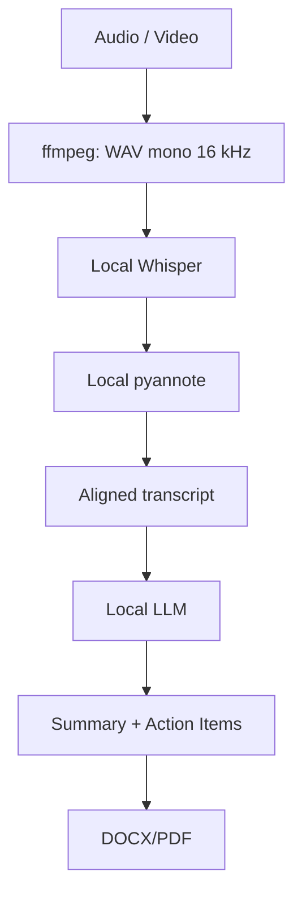

# HackAlem AI — протоколирование совещаний

Прототип команды Bling Bling: локальная загрузка записи совещания, распознавание
речи, различение говорящих, формирование саммари и поручений, экспорт протокола.
Главный источник требований — [ai-review/requirements.md](ai-review/requirements.md).

**Конфиденциальные данные не передаются во внешние AI API.**

Приложение использует локальные веса Whisper и pyannote, а текстовый анализ
отправляет только в Ollama на localhost. Облачного AI fallback нет. Модели
скачиваются отдельно, до обработки записей. Для сервера Ollama необходимо
включить `OLLAMA_NO_CLOUD=1`; настройка только в процессе FastAPI не меняет
уже работающий сервер Ollama.

## Архитектура



Стрелки показывают порядок стадий. Whisper и pyannote получают один подготовленный
WAV; alignment объединяет сегменты распознавания и интервалы говорящих.

- **API и хранение:** Python 3.11+, FastAPI, Pydantic, SQLAlchemy, SQLite.
- **Интерфейс:** локальные HTML/CSS/JavaScript, которые отдаёт тот же FastAPI.
- **STT:** faster-whisper; модель по умолчанию `large-v3`, устройство и compute type
  задаются через ENV. Используется `transcribe`, без перевода речи на русский.
- **Диаризация:** локальная `pyannote/speaker-diarization-community-1`.
  Метки `SPEAKER_00` различают голоса; биометрической идентификации нет.
- **Анализ:** `LocalMeetingAnalyzer` через интерфейс `LocalLLMClient` и адаптер
  `OllamaClient`. Поручения и summary возвращаются одним структурированным JSON.
- **Экспорт:** python-docx и ReportLab, без AI-вызовов.

## Реализованный сценарий

1. Создать встречу, указать название и необязательную дату.
2. Загрузить WAV, MP3, M4A, MP4 или WebM. ffmpeg выделяет аудио и сохраняет
   локальный WAV PCM16, mono, 16 kHz.
3. Запустить обработку. Интерфейс показывает текущую стадию через API статуса.
4. Просмотреть вкладки «Саммари», «Поручения», «Транскрипт» и исходные цитаты.
5. Скачать протокол DOCX/PDF: название, дата, краткое саммари, решения,
   таблица «№ / Поручение / Ответственный / Срок» и транскрипт.

Транскрипт сохраняет ID и временные метки; метки слов доступны, если их вернул STT.
Неоднозначная принадлежность реплики голосу отмечается явно. Имена можно назначить
через `/speakers` после диаризации и до анализа; формы сопоставления имён в UI нет.

У поручений есть ответственный, исходная формулировка срока или `null`, ссылки на
сегменты и цитаты. Поддержаны условные поручения и промежуточные сроки в `milestones`.
Проверяются JSON Schema, цитаты, источники и часть числовых данных; объединяются
точные дубли. Эти проверки не гарантируют смысловую правильность ответа LLM.
Исполнитель, срок и условие проверяются по показанным цитатам; для исполнителя
также допустимо подтверждённое имя говорящего. Условия и промежуточные сроки
сохраняются и в кратком списке поручений экспортируемого документа.

Если непустой транскрипт помещается в контекст, совместный анализ делает **1 вызов
LLM**. Только явное переполнение контекста включает chunking: компактные факты и
кандидаты поручений по частям, затем один финальный merge. При ошибке в JSON
автоматического повторного inference в совместном анализаторе нет.

**Повторное открытие результата, переключение вкладок и скачивание — 0 LLM-вызовов.**
Готовый анализ сохраняется до экспорта, поэтому повтор после ошибки экспорта также
использует кеш. Старые отдельные endpoints извлечения и summary сохранены для
совместимости; основной pipeline не вызывает их последовательно.

## Установка и запуск API/UI

Из корня репозитория в Windows PowerShell:

```powershell
py -3.11 -m venv .venv
.venv/Scripts/python.exe -m pip install -r requirements-dev.txt
$env:HACKALEM_FFMPEG_PATH = (& .venv/Scripts/python.exe -c "import imageio_ffmpeg; print(imageio_ffmpeg.get_ffmpeg_exe())")
.venv/Scripts/python.exe -m uvicorn app.main:app --host 127.0.0.1 --port 8000
```

Откройте **http://127.0.0.1:8000/**. Отдельный frontend-сервер не нужен.
`requirements-dev.txt` включает базовый API, экспорт, тесты и imageio-ffmpeg;
**зависимости и веса STT/диаризации, а также Ollama устанавливаются отдельно**.
Без моделей доступны UI, метаданные и `/health`; обработка сообщит об отсутствующей
зависимости. `/health` проверяет доступность API, а не готовность моделей.

Для Linux/macOS создайте окружение через `python3.11 -m venv .venv`, используйте
`.venv/bin/python` вместо `.venv/Scripts/python.exe` и синтаксис ENV своей оболочки.
Для базового API/UI без тестов достаточно `requirements.txt`; для экспорта нужен
`requirements-export.txt`. Вместо imageio-ffmpeg можно использовать ffmpeg в PATH
или указать его исполняемый файл через `HACKALEM_FFMPEG_PATH`.

### Подготовка локальных моделей

Установите зависимости:

```powershell
.venv/Scripts/python.exe -m pip install -r requirements-stt.txt -r requirements-diarization.txt
```

Подготовьте Whisper отдельной командой, пока доступна сеть:

```powershell
$env:WHISPER_MODEL = 'large-v3'
.venv/Scripts/python.exe scripts/prepare_whisper.py
```

Для менее мощного компьютера модель можно заменить на `medium`, `small` или другую
совместимую многоязычную модель. Для CPU можно задать `WHISPER_DEVICE=cpu` и
`WHISPER_COMPUTE_TYPE=int8`. Это выбор ресурсов, а не гарантия качества распознавания.
Существующие CTranslate2-веса можно указать через `WHISPER_MODEL_PATH`.

Для Community-1 предварительно примите условия доступа на странице модели,
указанной скриптом подготовки, и авторизуйтесь локально в Hugging Face:

```powershell
.venv/Scripts/hf.exe auth login
.venv/Scripts/python.exe scripts/prepare_diarization.py
```

Токен используется при подготовке весов; его нельзя помещать в Git или чат.
Если веса уже подготовлены, задайте `DIARIZATION_MODEL_PATH`. Скачивания во время
обработки встречи нет; адаптер включает HF offline и отключает телеметрию pyannote.

Установите Ollama и заранее подготовьте локальную модель. Её имя и качество не
зафиксированы проектом: требуется отдельная проверка на RU/KZ и structured output.
Запустите **сервер Ollama** в отдельном терминале:

```powershell
$env:OLLAMA_NO_CLOUD = '1'
$env:OLLAMA_HOST = '127.0.0.1:11434'
ollama serve
```

Если сервер уже работает, перезапустите его с этими настройками. В терминале API
укажите точное имя заранее установленной локальной модели из `ollama list`:

```powershell
ollama list
# Замените значение именем своей локальной модели, без cloud-тега.
$env:HACKALEM_OLLAMA_MODEL = 'имя-установленной-локальной-модели'
.venv/Scripts/python.exe -m uvicorn app.main:app --host 127.0.0.1 --port 8000
```

Остальные настройки модели и ffmpeg должны быть заданы в этом же терминале API.
Адаптер разрешает только HTTP loopback, не использует proxy/redirects и проверяет
метаданные локальности модели до передачи текста. Автоматического `pull` нет.
Клиент не может сам установить ENV в отдельном процессе сервера Ollama.

## Основные настройки

Конфигурация находится в [app/core/config.py](app/core/config.py). ENV-файл не
обязателен: можно задавать переменные в терминале. `.env` и `.env.*` исключены из
Git; `.env.example` в репозитории нет. Относительные пути разрешаются от корня проекта.

| Переменная | По умолчанию | Назначение |
| --- | --- | --- |
| `WHISPER_MODEL` | `large-v3` | Многоязычная модель |
| `WHISPER_MODEL_PATH` | `models/whisper/<имя модели>` | Каталог локальных CTranslate2-весов |
| `WHISPER_DEVICE` / `WHISPER_COMPUTE_TYPE` | `auto` / `auto` | CPU/CUDA и тип вычислений |
| `WHISPER_LANGUAGE` / `WHISPER_MULTILINGUAL` | авто / `true` | Без принудительного языка всей смешанной записи |
| `WHISPER_WORD_TIMESTAMPS` / `WHISPER_VAD_FILTER` | `true` / `true` | Метки слов и VAD |
| `DIARIZATION_MODEL_PATH` | `models/speaker-diarization-community-1` | Локальные веса Community-1 |
| `DIARIZATION_DEVICE` | `auto` | `cpu`, `cuda`, `auto` |
| `HACKALEM_OLLAMA_BASE_URL` | `http://127.0.0.1:11434` | Только локальный сервер |
| `HACKALEM_OLLAMA_MODEL` | пусто | Требует явного выбора установленной модели |
| `HACKALEM_LLM_NUM_CTX` / `HACKALEM_LLM_NUM_PREDICT` | `32768` / `4096` | Запрошенный контекст и лимит ответа |
| `HACKALEM_LLM_TIMEOUT_SECONDS` | `180` | Таймаут обращения к LLM |
| `HACKALEM_ANALYSIS_MAX_REQUESTS` / `HACKALEM_ANALYSIS_MAX_CHUNKS` | `12` / `6` | Лимиты попыток и частей при chunking |
| `HACKALEM_DATA_DIR` / `HACKALEM_DATABASE_PATH` | `data` / `<DATA_DIR>/meetings.sqlite3` | Локальные файлы и SQLite |
| `HACKALEM_FFMPEG_PATH` | `ffmpeg` | Исполняемый файл ffmpeg |
| `HACKALEM_MAX_UPLOAD_BYTES` / `HACKALEM_MAX_AUDIO_SECONDS` | `524288000` / `14400` | До 500 MiB и 4 часов; настраиваемые лимиты |
| `HACKALEM_PDF_FONT_PATH` | поиск локального Arial/DejaVu Sans | TTF для PDF; проверяется наличие нужных глифов |
| `HACKALEM_LOG_LEVEL` | `INFO` | Уровень логирования |

## API и локальные данные

| Endpoint | Назначение |
| --- | --- |
| `GET /health` | Проверка API |
| `POST /meetings` | Создать запись: `title`, необязательный `meeting_date` |
| `GET /meetings/{id}` | Метаданные встречи |
| `GET /meetings/{id}/status` | Статус загрузки/STT |
| `POST /meetings/{id}/upload` | Загрузить файл в multipart-поле `file` |
| `POST /meetings/{id}/analyze` | Запустить pipeline после загрузки |
| `POST /meetings/{id}/process` | Совместимый маршрут того же pipeline |
| `GET /meetings/{id}/pipeline/status` | Состояние, стадия, ошибка и ссылки экспорта |
| `GET /meetings/{id}/result` | Сохранённые `meeting`, `summary`, `action_items`, `transcript`; без AI |
| `GET /meetings/{id}/analysis` | Сохранённый анализ со счётчиками генерации |
| `GET /meetings/{id}/exports/{format}` | Скачать готовый `docx` или `pdf` |
| `GET /meetings/{id}/speakers` | Метки говорящих и ручные имена |
| `PUT /meetings/{id}/speakers` | Заменить сопоставление меток и имён |

Полная схема, включая отдельные STT, diarization, extraction и summary endpoints,
доступна по `/openapi.json`. Swagger/ReDoc отключены, чтобы не загружать ресурсы CDN.
Подробности основного API и UI: [docs/UI.md](docs/UI.md).

По умолчанию локально хранятся:

- `data/uploads/` — исходные записи;
- `data/processed/` — подготовленные WAV;
- `data/processed/{meeting_id}/transcript_raw.json` и `diarization.json`;
- `data/meetings.sqlite3` — метаданные, состояния, имена говорящих, анализ и alignment;
- `data/exports/{meeting_id}/protocol.docx` и `protocol.pdf`.

Данные, веса моделей и секреты исключены из Git. Файлы экспортируются обычными
Python-библиотеками; UI открывает скачивание после готовности обоих форматов.
Дата создания записи не подменяет неизвестную дату встречи.

## Проверки и фактические ограничения

Последний полный прогон после проверки по критериям: **213 passed**, включая
оба Chrome-сценария на ширинах 1280 и 390 px. `/health` вернул 200; компиляция
Python прошла. Конфликтов metadata установленных зависимостей не найдено.
Осталось предупреждение Starlette TestClient. При обычном запуске pytest без
браузерного режима два browser-теста пропускаются; включение описано в [docs/UI.md](docs/UI.md).

```powershell
.venv/Scripts/python.exe -m pytest -q
.venv/Scripts/python.exe scripts/smoke.py
```

В unit tests используются mock/double реализации `LocalLLMClient`, STT и диаризации.
Сквозные тесты реально проверяют HTTP, ffmpeg, SQLite и DOCX/PDF. В fixtures включены
оба исходных протокола; их готовые саммари не передаются анализатору. PDF и UI
проверены визуально; DOCX проверен структурно, без подтверждения вёрстки в Word.

Реальный STT-прогон выполнен на CPU с `small`: WER на отдельных примерах составил
7,7% для русского, 46,7% для казахского и 46,3% для склеенного RU/KZ аудио.
Это три примера, а не репрезентативная оценка. Естественное смешение языков внутри
предложения, `large-v3` и настоящая CUDA не проверены. Подробности:
[docs/STT_EVALUATION.md](docs/STT_EVALUATION.md).

**Полный pipeline с настоящими Community-1 и локальной LLM ещё не проверен.**
Их адаптеры реализованы; качество диаризации, поручений и summary не подтверждено
mock-тестами. Качество казахского и смешанной речи остаётся открытым требованием.

Ручная оценка текстового анализа запускается отдельно, после подготовки модели:

```powershell
.venv/Scripts/python.exe scripts/evaluate_protocols.py --run-local
```

Без `--run-local` этот скрипт не выполняет inference. Он сохраняет локальный отчёт
для проверки человеком, без дополнительного вызова LLM для оценки ответа.

В текущем MVP также нет авторизации, фоновой очереди, автоматического восстановления
после аварийного завершения процесса, редактирования протокола в UI, интеграций
Teams/Zoom/Google Meet, напоминаний, dashboard и СЭД. Обработка синхронная; интерфейс
параллельно опрашивает статус. Сервер рассчитан на локальный запуск на `127.0.0.1`.
Модели кешируются в памяти без автоматической выгрузки. Готовые протоколы являются
снимками: для новой записи или нового анализа создаётся другая встреча.

## Метрики и документация

Проверка по официальным критериям, приоритетные препятствия к реальной демонстрации
и сценарий показа: [docs/JUDGING_REVIEW.md](docs/JUDGING_REVIEW.md).

JSON-событие `analysis_metrics` на уровне INFO содержит число символов транскрипта,
приблизительные input tokens, модель, длительность, cache hit/miss и `llm_calls`.
Текст, prompts, цитаты и ответы модели в эти метрики не записываются.
Оценка токенов по UTF-8 байтам / 4 приблизительная и не определяет chunking.
Счётчик учитывает попытки `generate_json`, в том числе неуспешные; cache/GET дают 0.

- [Pipeline, chunking и кеш](docs/PIPELINE.md)
- [API, экспорт и UI](docs/UI.md)
- [Тесты двух протоколов, manual-проверка и метрики](docs/TESTING_AND_METRICS.md)
- [План реализации и история этапов](docs/IMPLEMENTATION_PLAN.md)
- [Отчёт о проверке требований](docs/REQUIREMENTS_REVIEW.md)

Код организован в `app/api`, `app/services`, `app/models`, `app/schemas`,
`app/repositories`, `app/db`, `app/core`; текстовые инструкции находятся в
`app/prompts`. Интерфейс — в `frontend`, тесты — в `tests`, утилиты подготовки
и оценки — в `scripts`.
