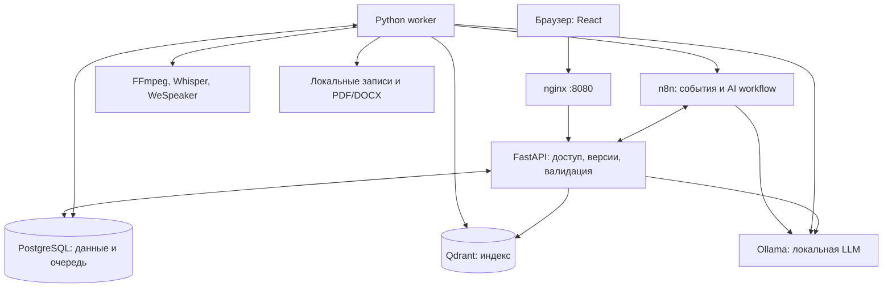

# HackAlem AI — локальный ИИ-ассистент для протоколирования совещаний

HackAlem AI помогает секретарям, руководителям и кураторам проектов превращать запись совещания в проверяемый протокол: кто, что и к какому сроку должен сделать. Ручная подготовка протоколов занимает время, а поручения, ответственные и уточнения сроков могут теряться. Приложение готовит черновик, связывает выводы с исходными репликами и передаёт результат человеку для проверки.

Это локальный веб-прототип для хакатона. Аудио и текст обрабатываются локальными моделями без облачных AI API. Целевые языки — русский, казахский и смешанная речь; количественная оценка качества на них пока не проведена.

## Что реализовано

- Создание совещаний с темой, датой, участниками и подтверждением права обработки записи; локальный вход и проверка доступа.
- Загрузка аудио/видео до 500 МБ и трёх часов либо ввод готового транскрипта.
- Локальное распознавание речи, временные метки и группировка реплик по голосам. Пользователь сопоставляет обозначения говорящих с именами участников.
- Извлечение поручений, исполнителей и сроков, объединение повторов, краткое саммари и проверка ссылок на источники. Неуказанный срок должен оставаться пустым.
- Просмотр хода обработки, реплик и источников; редактирование поручений, исполнителей, дат и статусов перед подтверждением протокола.
- Вопросы по подтверждённому совещанию с поиском по его содержимому (RAG) и ссылками на реплики; добавление текстовых справочников.
- Экспорт подтверждённой версии в PDF/DOCX, внутренние напоминания о сроках и удаление совещания с производными данными.

Наличие реализации не означает завершённую проверку качества: фактический статус испытаний приведён в разделе «Как проверить решение».

## Как работает решение

**Запись или текст → транскрипт → поручения и саммари → проверка человеком → подтверждённый протокол → вопросы и экспорт.**

Секретарь создаёт совещание и загружает исходные данные. Для записи worker извлекает аудиодорожку, распознаёт речь и выделяет говорящих. Затем агенты n8n через локальный Ollama последовательно анализируют части транскрипта, объединяют поручения, формируют итоги и проверяют источники. Backend проверяет структуру результатов и актуальность версии данных.

Пользователь проверяет выводы по репликам и записи, исправляет исполнителей и сроки, сохраняет правки и подтверждает протокол. После этого система индексирует подтверждённую версию для вопросов и позволяет подготовить PDF/DOCX. У готового текста нет искусственно придуманных временных меток.

## Установка и запуск

### Требования

Текущий сценарий установки рассчитан на Windows, Docker Desktop с Linux-контейнерами и поддержкой NVIDIA GPU, Docker Compose v2 и PowerShell 7 (`pwsh`). В Compose задано `gpus: all`; готовый сценарий для компьютера без NVIDIA не поставляется. Речь и embeddings работают на CPU.

Ориентир стенда из документации: RTX 3050 Laptop с 4 ГБ VRAM, около 8 ГБ RAM для Docker и не менее 15 ГБ свободного места под образы и веса. Это ориентир, а не измеренный минимальный порог. Интернет нужен при первоначальной сборке и скачивании моделей; Python и Node.js на хосте для Docker-запуска не требуются.

### Первый запуск

1. Скачайте или клонируйте репозиторий, откройте PowerShell в его корневой папке и запустите Docker Desktop.
2. Проверьте доступность инструментов:

   ```powershell
   docker version
   docker compose version
   pwsh --version
   ```

3. Если n8n ещё не установлен, выполните:

   ```powershell
   pwsh -File scripts/start.ps1 -ManagedN8n -PrepareModels
   ```

   Порты 8080 и 5678 должны быть свободны. Скрипт создаст `.env` из примера, сгенерирует секреты, соберёт приложение, загрузит модели и импортирует workflow. При первом открытии n8n создайте локального владельца. Этот вариант предусмотрен скриптом; чистая установка нового owner отдельно не проверена.

4. Откройте приложение и войдите с `ADMIN_EMAIL` и `ADMIN_PASSWORD` из созданного локального `.env`. О запуске с уже установленным n8n и повторном старте — ниже.

- **n8n:** http://localhost:5678
- **Приложение:** http://localhost:8080
- **Схема агентов:** http://localhost:5678/workflow/haWF03LocalFlow
- **Диспетчер:** http://localhost:5678/workflow/haWF02LocalFlow

Проект добавляет 18 схем с префиксом `[HA]`. Существующий `My workflow` не заменяется.

### Если n8n уже установлен

Из корня репозитория, если n8n уже работает в контейнере `hackathon_n8n`:

```powershell
pwsh -File scripts/start.ps1 -PrepareModels
```

Скрипт найдёт Docker даже вне PATH, подготовит `.env`, соберёт приложение, скачает модели, пересоздаст подготовительную сеть как внутреннюю, запустит сервисы и импортирует схемы. Перед импортом создаётся `.runtime/n8n-before-import.json`; для применения публикации n8n кратко перезапускается. Секреты не печатаются.

Для другого имени контейнера:

```powershell
pwsh -File scripts/start.ps1 -N8nContainer my_n8n -PrepareModels
```

Последующие запуски без сборки, скачивания и переимпорта:

```powershell
pwsh -File scripts/start.ps1 -SkipBuild -SkipImport
```

После изменения кода уберите `-SkipBuild`; после изменения схем — `-SkipImport`. Повторный импорт обновляет схемы **этого проекта**, в том числе ручные правки этих схем в редакторе. Сначала экспортируйте нужные изменения.

Если задано другое имя контейнера, сохраняйте `-N8nContainer my_n8n` и при последующих запусках.

### Вход

Приложение на порту 8080 использует `ADMIN_EMAIL` и `ADMIN_PASSWORD` из локального `.env`. Email по умолчанию — `admin@local.test`; пароль генерируется при первом запуске. Учётная запись n8n остаётся прежней. Не публикуйте `.env` и не включайте его в скриншоты.

Первичный пароль применяется только при создании администратора в БД. Изменение `ADMIN_PASSWORD` в `.env` не сбрасывает существующий пароль.

### Повторный запуск управляемого n8n

```powershell
pwsh -File scripts/start.ps1 -ManagedN8n -SkipBuild -SkipImport
```

При первом открытии n8n создайте локального владельца. В последующих запусках сохраняйте флаг `-ManagedN8n`. Профиль хранит n8n в отдельном Docker volume и открывает редактор через nginx; сам n8n находится во внутренней сети. Одновременно два n8n на порту 5678 не запускаются. На текущем компьютере проверен путь с существующим контейнером `hackathon_n8n`; установка нового owner с нуля отдельно не проходилась.

## Как проверить решение

### Воспроизводимый пример для жюри

Для быстрого знакомства используйте вымышленный текст: он проверяет анализ локальной LLM, подтверждение, RAG и экспорт, но не распознавание аудио.

Создайте совещание «Планирование проекта» с датой **23 сентября 2026 года, 10:00**, часовым поясом `Asia/Qyzylorda` и участниками **Айдана, Ерлан, Ботагоз**. Встроенная кнопка «Вымышленный пример» подставляет следующий текст:

```text
Председатель: Айдана, подготовь отчёт к пятнице.
Айдана: Да, подготовлю отчёт к пятнице.
Председатель: Ерлан должен обновить план безопасности. Срок пока не определён.
Ботагоз: По проекту выполнено 68 процентов работ.
Председатель: Итого: Айдана готовит отчёт, Ерлан обновляет план безопасности.
```

Ожидаемый результат, с которым нужно сравнить автоматический черновик:

| Поручение | Исполнитель | Срок |
| --- | --- | --- |
| Подготовить отчёт | Айдана | 25.09.2026 — пятница после даты совещания |
| Обновить план безопасности | Ерлан | Не указан |

Повтор в заключительной реплике не должен создавать дополнительные поручения. Сообщение о 68% выполненных работ — факт для саммари, а не новая задача. У поручений и саммари должны быть ссылки на исходные реплики. Сначала оцените автоматический результат, затем внесите необходимые правки.

Порядок проверки:

1. Создайте совещание: тема, дата, участники. Подтвердите уведомление участников и право обработки записи.
2. Загрузите аудио/видео до 500 МБ и трёх часов. Для быстрой проверки откройте «Вставить готовый транскрипт» → «Вымышленный пример» → «Анализировать».
3. Следите за этапами. n8n арендует один work unit каждые 10 секунд. Анализ охватывает все реплики, а не только top-k результаты поиска.
4. Проверьте говорящих, источники, поручения, исполнителей и даты. Неизвестный срок остаётся пустым. Сохраните правки.
5. Подтвердите протокол. Затем создаётся RAG-индекс подтверждённой ревизии.
6. Задайте вопрос: ответ содержит ссылки на реплики. Для аудио источник переводит плеер к времени; ручному тексту время не выдумывается.
7. Нажмите «Создать PDF» и «Создать DOCX», дождитесь ссылок на скачивание. Откройте оба файла и проверьте кириллицу, поручения, исполнителей и сроки. Внутренние напоминания формируются по расписанию, а не сразу после экспорта.

Для проверки речи создайте отдельное совещание и вместо текста загрузите разрешённую тестовую запись, например MP3 из `docs/`. Прослушайте фрагменты, сравните транскрипт с аудио, сопоставьте голоса в блоке «Кто говорит» и повторите анализ. Текстовые протоколы в `docs/` служат материалом для сравнения; готовые ответы из них не нужно добавлять во вход модели.

Большие записи обрабатываются частями. На 4 ГБ VRAM модель частично использует CPU: обработка может занять несколько минут. Это прототип обработки записей, не обещание работы в реальном времени.

### Статус испытаний

Результаты стенда на **23.09.2026** зафиксированы в [отчёте проверок](ai-review/validation-report.md):

| Проверка | Результат |
| --- | --- |
| Docker/React, Compose, тесты | Сборка прошла; 10 тестов инвариантов прошли |
| n8n и инструменты | 18 схем импортированы и опубликованы; WF00 проверил embeddings и native tool, в текстовом сценарии выполнено 5 вызовов backend tools |
| Текст → протокол → RAG → экспорт | Сквозной сценарий завершён: два поручения, верные исполнители, срок/его отсутствие, ответ с источниками, PDF и DOCX |
| Экспорт и интерфейс | Текст обоих файлов проверен, PDF просмотрен; в браузере проверены вход, поручения, ответ и ссылки на скачивание |
| Аудио | Проверены 45 секунд записи №1: ASR, 5 сегментов, 2 кластера голосов; загрузка через API → n8n → worker → WAV для плеера прошла |
| Аудио → черновик | Все 10 заданий завершились до `ready_for_review`; саммари потребовало 3 попытки |

При отладке текстового сценария одно задание было повторено после исправления схемы; финальный прогон завершился без failed jobs. Это не замер чистого первого запуска. Evidence Reviewer также выдал лишние предупреждения и один некорректный вызов инструмента: автоматический черновик требует проверки человеком.

Количественное качество RU/KZ/mixed, чистая установка managed-n8n с новым владельцем и полная сетевая изоляция Windows и существующего n8n **не проверены**. Проверка короткого аудиофрагмента подтверждает работу конвейера, но не точность распознавания, разделения голосов или извлечения поручений на всех записях.

## Технологии

| Компонент | Реализация |
| --- | --- |
| Workflow | n8n 2.40.5, native AI Agent, Ollama Chat Model, Workflow Tool |
| LLM | Ollama 0.34.3, `qwen3:4b-instruct-2507-q4_K_M`, контекст 4096 |
| Embeddings / RAG | `qwen3-embedding:0.6b`, Qdrant 1.19.1 |
| Backend | Python 3.11, FastAPI, SQLAlchemy, PostgreSQL 16.10 |
| Речь | FFmpeg/ffprobe, faster-whisper 1.2.0, `Systran/faster-whisper-small`, multilingual, CPU int8 |
| Говорящие | WeSpeaker ONNX, sherpa-onnx 1.13.8, scikit-learn для кластеризации embeddings |
| UI | React 19, TypeScript, Vite, локальные стили |
| Экспорт | python-docx, ReportLab, DejaVu Sans для RU/KZ |
| Развёртывание и проверки | Docker Compose, nginx 1.28.0, pytest, HTTPX; Node.js 24 для сборки UI в контейнере |

Точные зависимости зафиксированы в [requirements.txt](requirements.txt), [package.json](package.json) и [compose.yaml](deploy/compose.yaml). Основной агентский профиль использует контекст 4096; серверный default Ollama и отдельный backend-запрос могут использовать 8192. Модель анализа задаётся через `LLM_MODEL`, embeddings — через `EMBEDDING_MODEL`, пути весов речи — через `ASR_MODEL` и `SPEAKER_MODEL` в `.env`.

При обновлении ранней версии установите в существующем `.env` значение `LLM_MODEL=qwen3:4b-instruct-2507-q4_K_M` и повторите запуск с `-PrepareModels`, без `-SkipBuild` и `-SkipImport`, сохранив свой вариант подключения n8n. Установщик сохраняет уже заданные значения `.env`. Общий тег `qwen3:4b` в проверенном окружении использовал Thinking-вариант: он расходовал лимит генерации на рассуждения и пропускал вызовы инструментов. Финальный конвейер проверен с указанным Instruct-тегом.

## Архитектура проекта



FastAPI обслуживает UI и API, проверяет права и версии, хранит результаты и задания в PostgreSQL. Worker доставляет события в n8n и выполняет длительные операции с речью, индексом и экспортом. n8n запускает агентов и расписания, а Ollama исполняет локальные модели. Qdrant хранит векторы для поиска по подтверждённым данным. Источником состояния продукта остаётся PostgreSQL.

**n8n необходим текущему конвейеру анализа.** Упоминание его как необязательного компонента в ранней спецификации относится к прежнему плану. Тяжёлые задания выполняются последовательно; аренды, проверка ревизии и ограниченные повторы защищают от дублирования и публикации устаревших результатов.

### Структура репозитория

`backend/app/` — API, права, очередь, сроки, tools, RAG, speech и экспорт. `frontend/` — интерфейс. `deploy/` — Docker и шлюз. `workflows/n8n/` — отдельные JSON; `workflows/all.json` — общий импорт. `scripts/` — установка, генератор схем и реальный E2E. `tests/` — инварианты и вымышленный пример.

Подробнее: [архитектура](ai-review/implementation-architecture.md), [результаты проверок](ai-review/validation-report.md). Требования сохраняются в `docs/` и `ai-review/finalsolution.md`; приватный `local-ai-plans/start-project.md` остаётся вне Git.

## Схемы n8n

| ID | Назначение |
| --- | --- |
| WF00 | Ручная проверка реальных embeddings и вызова инструмента |
| WF01 | Защищённый webhook событий и маршрутизация |
| WF02 | Schedule Trigger, аренда задания и выбор analysis/QA |
| WF03 | Action Extractor, Reconciler, Summary Writer, Evidence Reviewer |
| WF04 | Фоновое индексирование RAG |
| WF05 | Meeting QA, поиск и источники |
| WF06 | PDF/DOCX |
| WF07 | Ежечасные внутренние напоминания |
| WF08 | Error Trigger с безопасными метаданными |
| WF09 | Восстановление истёкших аренд каждые 10 минут |
| SW00–SW07 | Echo, справочники, участники, сроки, реплики, кандидаты, поиск, подтверждённые задачи |

Каждое выполнение WF03 обрабатывает одну часть одной роли; следующий этап создаёт backend после полного покрытия предыдущего. Поэтому стрелка Switch к четырём агентам не означает одновременную загрузку четырёх моделей.

Агент не выбирает URL, не выполняет SQL/shell, не меняет scope, не подтверждает протокол и не отправляет сообщения. Лимиты: четыре итерации, шесть tools на попытку, одна коррекция JSON, максимум три попытки AI-задания. Права и актуальность ревизии проверяет backend при каждом обращении.

Генератор: `python scripts/generate_workflows.py`. JSON не содержит паролей. Credentials создаются отдельно в игнорируемой `.runtime/` и удаляются установщиком из временного файла контейнера после импорта.

### Автоматизированные проверки

```powershell
docker compose --env-file .env -f deploy/compose.yaml run --rm --no-deps api python -m pytest -q -p no:cacheprovider tests
docker exec -e N8N_RUNNERS_BROKER_PORT=5689 hackathon_n8n n8n execute --id=haWF00LocalFlow --rawOutput
docker compose --env-file .env -f deploy/compose.yaml exec -T api python scripts/smoke_e2e.py --base-url http://web --report /data/e2e-report.json
```

CLI n8n использует другой порт broker, чтобы не конфликтовать с сервером. Python runner внутри n8n не нужен этим workflow: Python работает в отдельном worker. Соответствующее предупреждение CLI не означает сбой распознавания речи.

Для управляемого профиля замените `hackathon_n8n` в команде на `hackalem-n8n-1`; для собственного контейнера — на его имя. E2E требует запущенного стенда, загруженных моделей и опубликованных workflow; он создаёт тестовое совещание в локальной БД и может выполняться несколько минут.

E2E создаёт вымышленное совещание и проверяет два поручения, исполнителей, срок/его отсутствие, реальные tools, RAG и оба файла. Mock-ответы в production не подключены. Фактические результаты перечислены в validation report, отдельно от планируемых проверок.

`scripts/smoke_audio.py <локальный файл>` проверяет реальные модели речи и таймкоды. `scripts/smoke_media.py <локальный файл>` проверяет путь загрузки через API, n8n и worker, затем доступность WAV для плеера. Эти скрипты запускаются в контейнере API; записи и отчёты остаются в локальном `/data`. Проверка загрузки завершается после ASR, анализ поручений продолжает работать в очереди.

Для диагностического продолжения прерванного **вымышленного теста** у `smoke_e2e.py` есть `--meeting-id <id>`. Для проверки новой версии конвейера запускайте новый тест без этого аргумента.

## Данные и интеграции

Рабочие источники данных — загруженные пользователем аудио/видео, введённые транскрипты, метаданные совещания и явно добавленные текстовые справочники. В [docs/](docs/) находятся ТЗ, две MP3-записи и два примера протоколов; в [tests/fixtures/synthetic/meeting.json](tests/fixtures/synthetic/meeting.json) — вымышленный сценарий для повторяемой проверки.

Внутренние интеграции используют REST API FastAPI, защищённые webhook n8n, локальный API Ollama и Qdrant. При подготовке окружения скачиваются контейнеры и зависимости, модели Qwen из каталога Ollama, Whisper из Hugging Face и WeSpeaker из релизов sherpa-onnx на GitHub. Облачные ключи AI-провайдеров и платные AI API для обработки совещаний не требуются.

### Хранение и сеть

Данные находятся в Docker volumes `hackalem_postgres_data`, `hackalem_app_data`, `hackalem_qdrant_data`; веса — `hackalem_ollama_data` и `hackalem_model_data`. Не используйте `docker compose down --volumes`, если хотите их сохранить. Для резервной копии нужны PostgreSQL и файловый том; Qdrant можно восстановить из подтверждённых документов.

API, worker, БД, Qdrant и Ollama используют внутреннюю сеть. nginx публикует 8080 только на loopback и закрывает `/internal/`. Подготовительный `compose.prepare.yaml` нужен только для скачивания моделей на пустом стенде. `OLLAMA_NO_CLOUD=1` запрещает cloud-режим модели.

Существующий n8n сохраняет исходные сети и настройки других workflow. Это **не доказательство полной изоляции компьютера**. Для закрытого контура дополнительно настройте egress firewall, HTTPS в LAN, доступ к редактору и отключение диагностик существующего n8n, затем проверьте сеть всего стенда. Свой Compose-профиль n8n уже отключает диагностики.

Не индексируются `.env`, репозиторий, планы разработчиков и эталонные протоколы из `docs/`. Справочники добавляются явно. Удаление сначала закрывает доступ, затем worker очищает файлы, экспорт и индекс. Пользовательские операции используют сессии; internal API — отдельный credential.

## Ограничения текущей версии

Поддержаны загруженные записи и готовый текст. Автоподключение к Teams/Zoom/Meet, live-транскрибация, внешняя рассылка и СЭД пока не реализованы.

Стартовый профиль говорящих использует доступные без gated-токена [WeSpeaker weights через sherpa-onnx](https://k2-fsa.github.io/sherpa/onnx/speaker-identification/index.html), вместо pyannote из первоначального плана. Кластеры `SPEAKER_01` не устанавливают личность. Пользователь сопоставляет голоса с участниками в блоке «Кто говорит»; затем анализ запускается заново. API: `POST /api/meetings/{id}/speaker-map` с `mapping` и `expected_revision`. Короткие и перекрывающиеся реплики требуют проверки.

RU/KZ/mixed качество нужно измерять на размеченных записях: запуск multilingual-модели сам по себе не доказывает точность. Человек подтверждает результат. Для машины без NVIDIA нужен CPU override, а смена LLM/embeddings требует повторных реальных тестов и переиндексации.

Поиск ограничен выбранным совещанием, общего поиска по архиву нет. Управление пользователями и доступом реализовано через API, но отдельная административная панель отсутствует. Напоминания отображаются внутри приложения; email и мессенджеры не подключены. Промышленное развёртывание, полноценные миграции схемы БД, резервное копирование и политика хранения требуют дальнейшей настройки и испытаний.

## Развёрнутая версия

Публичная deployed-версия в репозитории и документации не указана. После локального запуска приложение доступно по адресу **http://localhost:8080**, редактор n8n — **http://localhost:5678**. Эти адреса работают на машине со стендом и не являются публичными ссылками для удалённого доступа жюри.
