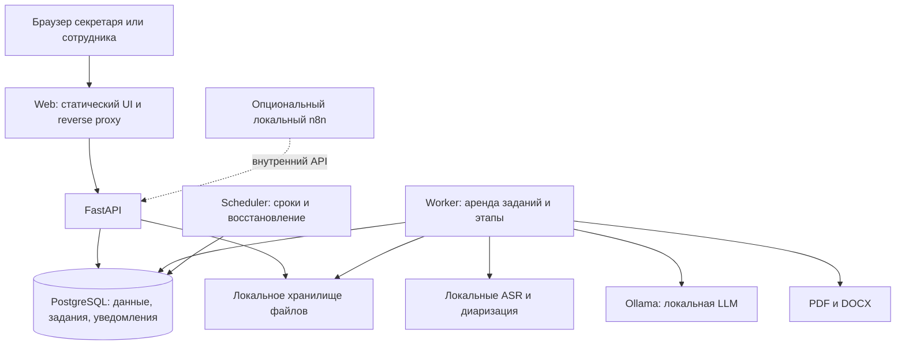

# Final solution: спецификация реализации

Версия 1.0 · 23.09.2026 · Статус: план, реализация ещё не начата.

**Назначение:** основной документ для последующих циклов «реализация → тестирование → отладка». Он фиксирует выбранную архитектуру, стек, границы продукта и признаки готовности. Наличие файла не означает, что приложение, модели или инфраструктура уже работают. Запуск разработки выполняется по следующей команде пользователя.

## 1. Основания и приоритеты

Источники: [ТЗ](../docs/HackAlem%20AI_%20Система%20автопротоколирования%20совещаний%20с%20фиксацией%20поручений.md), [протокол №1](../docs/Протокол_совещания№1.docx.md), [протокол №2](../docs/Протокол_совещания№2.docx.md), инструкции `01–06` в этой папке и локальные исследования `local-ai-plans/{ai-usage,solution,n8nconnect,n8nCloude}.md`. MP3 из `docs/` ещё нужно сверить с текстами и разметить; качество распознавания на них пока не измерено.

Локальные исследования исключены из Git. Все решения, необходимые для разработки, перенесены сюда; их отсутствие у другого участника не должно блокировать работу. Промокоды, персональные ссылки активации, секреты и содержимое `.env` в спецификацию не переносить.

Приоритет: актуальные указания пользователя и согласованные изменения ТЗ → само ТЗ → этот документ → прежние варианты архитектуры. Здесь окончательно выбраны PostgreSQL вместо вариантов с SQLite, отдельный worker и необязательный локальный n8n. Разделение состояний Job и Meeting ниже уточняет предварительную схему из `02-architecture.md`. Новые технические решения с причиной и проверкой фиксировать в разделе изменений этого документа; не переписывать требования ради прохождения теста.

## 2. Решение и границы

Строим локальное веб-приложение для секретаря и ответственных сотрудников. Оно принимает запись, распознаёт речь и говорящих, извлекает поручения и саммари, позволяет проверить результат, экспортирует PDF/DOCX и показывает напоминания.

**Инварианты:**

1. Аудио, транскрипт, поручения и документы обрабатываются внутри разрешённого контура. Никаких внешних AI API и скрытого переключения на облако.
2. Основной сценарий после подготовки зависимостей и весов работает без внешнего интернета, без n8n Cloud, промокредитов и внешней авторизации.
3. Говорящий не обязательно исполнитель. Неизвестный участник, исполнитель или срок сохраняется как неизвестный.
4. Поручение и существенный факт саммари имеют ссылки на исходные реплики. Валидный JSON не доказывает правильность смысла.
5. Ручные правки версионируются, пересчёт не стирает их молча. Экспорт относится к конкретной ревизии.
6. Повторный запрос, падение процесса или повтор напоминания не создают дубли пользовательских результатов.
7. Тестовые заглушки явно отделены от настоящих моделей. Успех тестов с заглушкой не является подтверждением AI-функций.

### Объём поставки

| Приоритет | Возможности | Условие |
| --- | --- | --- |
| Основная поставка | Загрузка аудио/видео, RU/KZ/смешанная речь, диаризация, привязка говорящих, поручения, саммари, проверка, PDF и DOCX | Обязательная проверка на реальных локальных моделях |
| Основная поставка | Локальные пользователи, права на совещания, уведомление о записи/подтверждение права обработки, напоминания, удаление данных | Следует из сценариев и ограничений ТЗ |
| Следующий этап входных каналов | Запись из браузера, live-поток, участие в Teams/Zoom/Google Meet | Для каждого канала отдельная интеграция и проверка границ контура |
| Расширение | Локальный n8n, дополнительные каналы уведомлений, классификация, СЭД, биометрическая идентификация | Не должно задерживать основной путь |

ТЗ перечисляет внешние конференции, но обязательность каждого канала для прототипа неоднозначна. Не считать их автоматически реализованными через загрузку файла. Без согласованного сокращения объёма отражать их как незакрытые требования входных каналов. Допускается закончить проверенный MVP, но не объявлять полное покрытие всех перечисленных возможностей.

Подписки и промокредиты пригодны для разработки и отдельных экспериментов на разрешённых вымышленных данных. Они не меняют ограничения ТЗ. n8n Cloud trial не входит в финальную инфраструктуру; наличие арендованной GPU также не означает её принадлежность закрытому контуру.

## 3. Архитектура

Выбран модульный backend с отдельными процессами API, worker и scheduler. Сначала один worker и одна тяжёлая задача за раз; разделение на множество AI-микросервисов, Redis и Kubernetes не нужны для первого результата.



Все узлы на схеме находятся внутри разрешённого контура. Браузер получает приложение и шрифты локально. Внешние CDN, аналитика и онлайн-сервисы генерации документов не используются.

API принимает файл и создаёт задание, возвращая `202` и `job_id`; обработка не держит HTTP-запрос открытым. Worker сохраняет результат в базе, UI запрашивает статус через API. Scheduler создаёт внутренние напоминания. n8n не является очередью, хранилищем результата или владельцем бизнес-логики.

## 4. Зафиксированный стек

Версии ниже — начальные совместимые семейства/модели, а не обещание проверенной сборки. На этапе E0 выбрать точные версии, проверить совместимость и сохранить lock-файлы и digest образов. Не обновлять зависимости автоматически между итерациями.

| Слой | Выбор | Назначение |
| --- | --- | --- |
| UI | React + TypeScript + Vite; обычный CSS | Загрузка, плеер, транскрипт, таблица поручений, правки и экспорт |
| API | Python 3.11, FastAPI, Pydantic 2, Uvicorn | REST, схема данных, валидация и локальная авторизация |
| Данные | PostgreSQL 16, SQLAlchemy 2, Alembic | Единая база бизнес-данных и устойчивых заданий |
| Worker | Отдельный Python-процесс, PostgreSQL job queue | Последовательные AI-этапы, повторы, восстановление |
| Аудио | FFmpeg/ffprobe, faster-whisper | Проверка/извлечение дорожки и транскрибация |
| Диаризация | pyannote.audio + speaker-diarization-community-1 | Интервалы говорящих без облачного API |
| Анализ текста | Ollama, начальный кандидат qwen3:8b | Поручения и саммари по JSON Schema |
| Экспорт | python-docx и ReportLab | DOCX/PDF из общего представления результата |
| Проверки | pytest, HTTPX, Ruff; Vitest/Testing Library, Playwright | Правила предметной области, API, UI и сквозные сценарии |
| Упаковка | Docker Compose v2; Linux-контейнеры, на Windows WSL2 | Воспроизводимый локальный стенд |
| Автоматизация | Scheduler внутри проекта; n8n в опциональном профиле | Напоминания без обязательной внешней платформы |

FastAPI поддерживает сборку собственного контейнера; использовать один процесс API в контейнере и отдельный worker, а не выполнять тяжёлую работу в web-процессе. [Официальная документация контейнеров](https://fastapi.tiangolo.com/deployment/docker/).

### Модельный профиль

- **ASR:** начальный профиль качества — multilingual `large-v3` в формате faster-whisper; загрузка по локальному пути. Для разработки на ограниченном CPU допускается явно выбранный `small` с int8. Это другой профиль качества, не молчаливый fallback. Фиксировать модель и compute type в результате. [faster-whisper](https://github.com/SYSTRAN/faster-whisper).
- **Диаризация:** `pyannote/speaker-diarization-community-1`, локальная копия всех весов. Доступ к файлам требует принятия условий Hugging Face; получить доступ на этапе подготовки, не подменять отсутствие весов облачной моделью. После подготовки запускать из локального каталога. Сохранить лицензию и атрибуцию. [Карточка модели и offline use](https://huggingface.co/pyannote/speaker-diarization-community-1).
- **LLM:** `qwen3:8b` через локальный Ollama — конкретный стартовый кандидат, а не подтверждённый победитель на казахском. Размер, квантование, digest и контекст записать в манифест. Проверить качество, память и скорость; менять только по результату сравнения. [Карточка модели](https://ollama.com/library/qwen3:8b).
- **Структура:** JSON Schema/Pydantic передавать в локальный запрос и валидировать ответ повторно в приложении. Форматирование не заменяет проверки доказательств и дат. [Structured outputs Ollama](https://docs.ollama.com/capabilities/structured-outputs).

До обещаний производительности проверить CPU, RAM, GPU/VRAM и доступность драйверов. Последовательно выгружать ASR/диаризацию перед LLM при ограниченной памяти; контролировать также удержание модели сервером Ollama. Совместимость PyTorch, CTranslate2, CUDA и декодирования аудио проверять реальным запуском. Если общий worker-образ несовместим, разрешено выделить ASR/диаризацию в локальный процесс/контейнер с тем же контрактом, записав причину.

## 5. Структура репозитория, которую нужно реализовать

```text
frontend/                  # React UI, компоненты, локальные стили
backend/
  app/
    api/                   # маршруты, авторизация, зависимости
    domain/                # поручения, сроки, ревизии, права
    db/                    # таблицы и репозитории
    jobs/                  # очередь, аренда, этапы и отмена
    adapters/              # ASR, diarization, LLM, filesystem
    services/              # оркестрация и прикладные операции
    exports/               # общее представление, PDF/DOCX
    worker.py
    scheduler.py
    main.py
  migrations/
  tests/
tests/
  e2e/
  fixtures/                # только разрешённые вымышленные примеры
  evaluation/              # эталоны и расчёт метрик
deploy/                    # Compose, Dockerfiles, proxy
scripts/                   # подготовка/проверка весов, smoke/offline checks
workflows/                 # JSON локального n8n, если модуль реализован
ai-review/
  finalsolution.md          # эта спецификация
  development-status.md    # создаётся при начале реализации
  validation-report.md     # создаётся по мере фактических проверок
.env.example               # безопасные примеры настроек
README.md                  # воспроизводимый запуск
```

Модели, пользовательские файлы, база, build/cache и реальные секреты находятся в локальных томах/каталогах и исключаются из Git до создания. Не переносить исходные MP3 и ФИО из `docs/` в новые публичные fixtures без решения по праву использования. Этот документ не создаёт перечисленные модули заранее.

## 6. Данные и состояния

| Сущность | Минимальный контракт |
| --- | --- |
| User / MeetingAccess | Локальная учётная запись; роли владельца/редактора/читателя на конкретное совещание |
| Meeting | UUID, владелец, тема, `started_at`, IANA timezone, участники, lifecycle, текущая и подтверждённая ревизия |
| Media | meeting ID, серверный путь, исходное имя как метаданные, фактический формат, длительность, размер, hash |
| Segment | ID, абсолютные `start_ms/end_ms`, speaker ID, исходный текст, language, отметки проверки |
| SpeakerMapping | speaker ID → participant ID либо null; признак подтверждения |
| ActionItem | Суть, assignee, due, источники, статус исполнения, версия, отметки проверки |
| SummaryItem | Тема, тип «факт/решение/риск/вопрос», текст, source segment IDs |
| Job | Тип, meeting ID, входная ревизия, status, stage, попытки, lease/heartbeat, ошибка, provenance |
| Notification | Получатель, поручение, тип, версия срока, created/read; уникальный ключ дедупликации |
| Export | Meeting ID, неизменяемая ревизия, формат, путь, статус генерации |

`assignee`: `person | department | unknown`, отображаемое имя и необязательный participant ID. Участник совещания и пользователь приложения — разные сущности; для доставки поручения пользователю нужно явное соответствие. Для отдела/неизвестного исполнителя уведомление получает назначенный куратор либо владелец совещания, без автоматического предоставления доступа посторонним.

`due`: `raw`, `kind=date|range|relative|event|missing`, `date`, `range_start/end`, `event_ref`, `confirmed`, `normalization_note`. Неизвестные поля — null. Источники — существующие сегменты того же совещания и ревизии.

Состояния разделены:

- **Job:** `queued → running → succeeded | failed | canceled`; `stage=preprocessing|transcribing|diarizing|extracting|exporting` описывает прогресс. `succeeded` обработки означает готовность черновика, а не одобрение человеком.
- **Meeting:** `draft → processing → ready_for_review → confirmed`; ошибка processing возвращает видимую ошибку задания и сохраняет последнюю доступную ревизию. Повторный анализ создаёт новый черновик, не изменяет старую подтверждённую версию.
- **ActionItem:** `open | in_progress | done`; просрочка — вычисляемое свойство подтверждённого срока, не замена статуса.

Служебное время хранить в UTC; даты поручений и границы интервалов трактовать в timezone совещания. Не использовать часовой пояс сервера как неявное правило.

## 7. API и устойчивость

Маршруты ниже — обязательный проектный контракт с префиксом `/api/v1`. Они ещё не реализованы.

| Маршрут | Поведение |
| --- | --- |
| `POST /auth/login`, `POST /auth/logout`, `GET /auth/me` | Локальная сессия пользователя |
| `POST /meetings`, `GET /meetings` | Создание и список доступных пользователю записей |
| `POST /meetings/{id}/media` | Потоковая загрузка, валидация и сохранение |
| `GET /meetings/{id}/media` | Авторизованное прослушивание с поддержкой диапазонов байт |
| `POST /meetings/{id}/process` | `202 + job_id`, ключ идемпотентности; задание в PostgreSQL |
| `GET /jobs/{id}`, `POST /jobs/{id}/cancel` | Статус и запрос отмены с проверкой доступа |
| `GET /meetings/{id}/result` | Ревизия, сегменты, привязки, поручения и саммари |
| `PATCH /meetings/{id}/result` | Правки с ожидаемой ревизией; при конфликте `409` |
| `POST /meetings/{id}/confirm` | Подтверждение конкретной ревизии после проверки |
| `PATCH /actions/{id}` | Изменение статуса/срока с правами и версией |
| `POST /meetings/{id}/exports` | Задание генерации PDF/DOCX фиксированной ревизии |
| `GET /exports/{id}/download` | Авторизованная выдача готового документа |
| `GET /notifications`, `POST /notifications/{id}/read` | Внутренние напоминания |
| `DELETE /meetings/{id}` | Остановка обработки и удаление производных данных |
| `GET /health/live`, `GET /health/ready` | Жив ли процесс; доступны ли БД/хранилище и нужные компоненты |

Worker атомарно арендует строку задания через транзакцию и `FOR UPDATE SKIP LOCKED`, затем обрабатывает вне транзакции. PostgreSQL допускает этот механизм для очередей; он не предназначен для общей согласованной выборки данных. [PostgreSQL SELECT](https://www.postgresql.org/docs/16/sql-select.html).

Lease содержит `worker_id`, срок и fencing token; heartbeat продлевает её. Результат записывается только при действующей аренде и совпадении входной ревизии. Истёкшая аренда допускает повтор, но устаревший worker не может перезаписать результат. Уникальные ограничения и атомарная публикация артефактов предотвращают дубли при повторном выполнении. Не обещать exactly-once выполнение вычислений.

Начальные проектные настройки: одна тяжёлая работа одновременно, не более трёх попыток задания, максимум один повтор восстановления невалидного JSON. Повторять временные ошибки, а не повреждённый файл или отсутствие весов. Значения конфигурируемые и подтверждаются тестами. Отмена проверяется между этапами/чанками; удаление запрещает последующую публикацию результата даже если вычисление ещё завершается.

## 8. AI-конвейер и правила извлечения

1. Проверить фактический формат, размер, длительность и наличие аудиодорожки через ffprobe. Запускать FFmpeg списком аргументов без shell-интерполяции. Лимиты — конфигурация; исходные имена не использовать как пути.
2. Сохранить оригинал и отдельную нормализованную mono 16 kHz дорожку. Не терять карту времени при обработке пауз и чанков. Тишина даёт состояние «речь не обнаружена», без выдуманного протокола.
3. ASR сохраняет исходный язык и временные метки слов/сегментов. Не включать перевод и не фиксировать русский для всей смешанной записи. Ошибки смены языка проверять отдельно.
4. Диаризация создаёт интервалы speaker IDs; совместить со словами по времени, разбить реплики на сменах. Перекрытия и неоднозначность отмечать для проверки.
5. Сопоставить говорящих со списком участников как предложение. Имя подтверждает человек; голосовой номер не является доказательством личности.
6. Локальная LLM извлекает кандидаты поручений с доказательствами по частям с перекрывающимся контекстом. Затем общий проход разрешает уточнения, связи и повторы. Соблюдать размер контекста, не обрезать конец совещания молча.
7. Валидировать типы, даты, ссылки и конфликтующие поля. Транскрипт — данные, его инструкции не запускают инструменты, команды и сети. Неподтверждённое значение становится null/needs_review.
8. Построить саммари из доказанных фактов, решений и поручений. Проверить числа, отрицания, статус риска и причинно-следственные связи. Сохранить модель, параметры, версию prompt/schema, входной hash и время этапов.

### Сроки и повторы

Всегда сохранять исходный срок. Отсчёт идёт от даты совещания, не загрузки. При отсутствии года, календаря или точки отсчёта — предложенное значение с отметкой проверки либо null; до подтверждения напоминания не создаются.

Проектные правила по умолчанию: неделя понедельник–воскресенье, «за две недели» — 14 календарных дней, «на следующей неделе» — интервал, дата без времени — до конца местного дня. Это правила продукта, не факты ТЗ; показать их пользователю при нормализации. Рабочие дни считать только при заданном календаре. «После совещания» — зависимость от события. Для пятницы, упомянутой в пятницу, требовать уточнение.

Дедупликация учитывает смысл действия, исполнителя и источники. Разные действия одного человека не объединять. Составные задачи с разными сроками разделять, сохраняя связь. Последнее явное уточнение отменяет ранний срок; противоречие без однозначного уточнения показывать человеку.

### Эталоны из docs

| Пример | Обязательное ожидаемое поведение |
| --- | --- |
| №1: химическая промышленность | Пять действий; юридический департамент — самостоятельный исполнитель |
| №1: безопасность | Ещё пять базовых действий; финальное повторение не создаёт дублей |
| №1: аудит | Учтено уточнение «две → три недели → 15 октября» с неизвестным/подтверждённым годом |
| №1: заключение юристов | Обещание Айнур «к среде» связано с соответствующей задачей |
| №2: претензия | Исполнитель Ерлан, хотя он не говорит |
| №2: обучение | Неделя относится к смете, месяц — к закрытию очереди |
| №2: справка | Срок связан с окончанием совещания подрядчиков |
| №2: договор | Пять рабочих дней — условие выставления счёта, не срок подготовки шаблона |

Во втором примере шесть итоговых строк не являются обязательным числом атомарных задач. Проверять смысл и полноту, а не подгонять число. Показатели 71/8/60% и 94/68/12% сохранять с правильным контекстом. Дополнительные примеры: [правила анализа](04-actions-and-summary.md).

## 9. UI, проверка человеком, экспорт и напоминания

Минимальные экраны: вход; список совещаний; создание/загрузка; прогресс по этапам; рабочий экран проверки; поручения/уведомления. На экране проверки рядом доступны плеер, реплики, говорящие, саммари и таблица задач. Щелчок по доказательству открывает соответствующий момент записи.

Показывать неопределённость конкретного поля, а не произвольную общую «уверенность 99%». Пользователь может переименовать speaker, изменить текст, исполнителя или срок, сохранить черновик и подтвердить ревизию. Можно подтвердить результат с явно неизвестными полями, но нельзя автоматически достроить их. Правка исходного сегмента помечает зависимые выводы устаревшими; новый AI-результат сравнивается с ручным вариантом перед принятием.

Единая export view model питает PDF и DOCX: тема, дата/часовой пояс, участники, саммари, решения, поручения, транскрипт с временными метками, ревизия и отметка черновика. Включить локальные шрифты с Ә, Ғ, Қ, Ң, Ө, Ұ, Ү, Һ, І; проверить переносы таблиц и длинные ФИО визуально. Не выдавать черновик за подтверждённый документ.

Scheduler периодически сканирует сроки и создаёт внутренние уведомления. Интервал и время предупреждения настраиваются. Уникальность: `action_id + due_version + notification_type + recipient_id`. Выполненные задачи исключаются; перенос срока отменяет устаревшие события. После простоя обработать пропущенное без повторов. Для диапазона использовать только подтверждённую конечную границу; для событийного срока нужна явная дата события.

## 10. Роль n8n

Основной путь работает без n8n. При включённом локальном профиле `automation` он может вызывать внутренние маршруты проверки сроков, запускать экспорт или интеграцию. Доступ — отдельный ограниченный service credential. Передавать ID и команды, а не аудиофайл или полный транскрипт по узлам workflow.

В одном окружении активен один источник расписания напоминаний: встроенный scheduler либо n8n. Backend всё равно обеспечивает дедупликацию. Собственную служебную БД n8n отделить от таблиц приложения. Сохранять его данные и ключ шифрования локально, отключить внешние функции и контролировать историю исполнений. Повторить настройки и проверки из локального исследования, используя официальную [инструкцию изоляции n8n](https://raw.githubusercontent.com/n8n-io/n8n-docs/main/docs/deploy/host-n8n/configure-n8n/basic-configuration/configuration-examples/isolate-n8n.md).

n8n Cloud и его trial не являются решением проблемы закрытого контура. Доступность облачной схемы неделю не равна бесплатности моделей, backend и хранилища. Этот эксперимент не нужен для готовности основной поставки.

## 11. Развёртывание, настройки и данные

Compose-сервисы: `web`, `api`, `worker`, `scheduler`, `postgres`, `ollama`; одноразовый `migrate`; опциональный `n8n`. Данные — отдельные постоянные тома для PostgreSQL, файлов и моделей. API/worker используют общий код, AI-зависимости устанавливать только в нужный образ. UI собирается заранее и отдаётся локальным web-сервисом.

Опубликовать только web-порт на loopback для одного компьютера. Для LAN — внутренний HTTPS и права доступа. БД, Ollama и worker не публиковать наружу. Внутренняя Docker-сеть и firewall ограничивают выход; проверять также браузер и программы хоста. Не считать флаг сети единственным доказательством изоляции.

Минимальная `.env.example`: `DATABASE_URL`, `SESSION_SECRET`, `STORAGE_ROOT`, `ASR_MODEL_PATH`, `DIARIZATION_MODEL_PATH`, `OLLAMA_BASE_URL`, `LLM_MODEL`, `AI_PROFILE`, `MAX_UPLOAD_BYTES`, `MAX_AUDIO_SECONDS`, `WORKER_CONCURRENCY`, `RETENTION_DAYS`, `REMINDER_LEAD_HOURS`, `SCHEDULER_MODE`. Реальные значения не выводить в логи. Новые настройки загружать в типизированную конфигурацию и документировать; здесь имена задают будущий контракт.

Подготовку и runtime разделить: сначала загрузить версии образов, зависимости, шрифты, лицензии и все веса; затем запускать офлайн. Создать манифест моделей с источником, ревизией/hash, лицензией и профилем качества. Проверка готовности должна сообщать о недостающих весах, не скачивать их автоматически. Воспроизводимый запуск на чистом целевом хосте описать в README с фактически проверенными командами и оборудованием.

Локальная авторизация: пароли с современным password hash, серверные сессии, HttpOnly cookies, CSRF-защита изменяющих запросов, HTTPS при сетевом доступе. На каждом маршруте, включая media и export, проверять доступ к конкретному объекту. Не иметь пароля администратора по умолчанию; создать владельца через отдельный bootstrap.

Логи содержат ID, этап, длительность и код ошибки, без транскриптов/секретов. Удаление совещания сначала запрещает доступ и публикацию результатов, останавливает задания, затем удаляет файлы и связанные записи; повторная очистка идемпотентна. Для backup описать срок хранения и восстановление. `.gitignore` не является шифрованием или ограничением чтения AI-инструментами.

## 12. Этапы реализации и признаки завершения

| Этап | Реализация | Обязательная проверка перед закрытием |
| --- | --- | --- |
| E0. Подготовка | Инвентаризация кода/оборудования, lock-файлы, модельный манифест, права на данные | Известны доступность весов и ресурсы; отдельные реальные smoke-запуски моделей либо явно записанный блокер |
| E1. Основа | Compose, БД/миграции, API, локальный вход, UI, очередь и worker с явной заглушкой | Чистый запуск, CRUD, доступ другого пользователя запрещён, восстановление очереди |
| E2. Речь | Файлы, FFmpeg, ASR, диаризация, плеер и привязки | Реальная запись проходит до сегментов; шум/тишина/ошибка файла; замеры RU/KZ/mixed |
| E3. Анализ | Локальная LLM, схемы, сроки, доказательства и дедупликация | Регрессии двух протоколов и ручная проверка вымышленных языковых fixtures |
| E4. Проверка и документы | Ревизии, редактирование, подтверждение, PDF/DOCX | Конфликт правок, сохранность ручного текста, визуально проверенные документы одной версии |
| E5. Надёжность | Напоминания, очистка, таймауты/повторы, мониторинг статусов | Тестовые часы, restart/cancel/delete во время работы, отсутствие дублей |
| E6. Поставка | README, офлайн-комплект, отчёт метрик, сквозной прогон | Запуск без внешнего интернета от записи до экспорта и уведомления |
| E7. Расширения | n8n, запись/live, адаптеры конференций в согласованном объёме | Каждый заявленный канал проверен отдельно; ограничения явно перечислены |

E0–E6 — критерий готовности основной поставки. E7 вести отдельно, не помечать выполненным за наличие диаграммы. Допустимо продолжать независимую разработку при блокере модели/оборудования, но соответствующие этапы и итоговую AI-приёмку не закрывать.

## 13. Тестирование и приёмка

### Уровни

- **Модульные:** нормализация дат с фиксированными часами, дедупликация, права, ревизии, валидатор доказательств, вычисление просрочки.
- **Интеграционные:** API + настоящий PostgreSQL + filesystem, гонка аренды, повтор запроса, отмена/удаление, восстановление после сбоя. SQLite не подменяет проверку PostgreSQL-очереди.
- **UI/E2E:** вход, загрузка, прогресс, привязка говорящего, исправление, подтверждение, скачивание, уведомления. Моки допустимы для быстрых тестов UI, отдельный прогон обязателен с реальными моделями.
- **AI-evaluation:** ASR WER/CER, diarization DER, precision/recall поручений, отдельная точность исполнителя/срока, ручная проверка фактов саммари.
- **Offline/export:** запрет внешнего трафика, готовые веса, визуальная проверка PDF/DOCX, контроль повторного запуска и восстановления данных.

Для оценки из Markdown подавать только реплики: готовые таблицы и саммари исключить из входа модели. Эталон подготовить отдельно. Разметить минимум по одному короткому аудиопримеру каждого языка/смешанной речи с несколькими говорящими и поручениями; отделить материал разработки от финального контрольного набора. Это минимальная функциональная проверка, не статистическая гарантия качества.

Начальные внутренние критерии основного набора: все перечисленные регрессии раздела 8 пройдены, в финальных контролируемых примерах нет неподтверждённых исполнителей/сроков/решений и пропущенных размеченных поручений. Сначала измерить **автоматический** результат, затем отдельно результат после ручных правок; не скрывать ошибки ASR/LLM за исправлением человеком.

Численные WER/CER/DER и производительность записывать с правилами подсчёта, hardware и версиями. ТЗ не задаёт процентные пороги — не приписывать ему придуманные SLO. Новые целевые пороги выбрать по baseline и сохранить до итогового прогона; не снижать их задним числом ради статуса «готово».

Результат проверки: команда/набор данных, режим real/mock, версия, ожидание, фактический результат, артефакт отчёта и оставшиеся ограничения. Отсутствующий GPU, вес или доступ к записи — `blocked/not_run`, а не `passed`. Заглушки не допускаются в демонстрационном профиле без явной маркировки.

### Связь с оценкой хакатона

| Критерий ТЗ | Баллы | Что предъявляем |
| --- | --- | --- |
| Работоспособность | 25 | Сквозной сценарий на записи, все семь пунктов обязательного минимума |
| Техническая реализация | 25 | Локальный конвейер, контракты, устойчивые задания, доказательства и измерения |
| README/воспроизводимость | 25 | Чистый запуск по инструкции, версии и веса, профиль оборудования, offline-прогон |
| Ценность | 15 | Проверка секретарём, корректные поручения, документы и напоминания |
| Развитие/оригинальность | 10 | Прозрачные источники выводов, смешанная речь, расширяемые адаптеры |

## 14. Протокол циклической разработки

Эта секция начинает действовать после команды пользователя на реализацию. Она не создаёт расписание, автоматизацию или фоновый бесконечный процесс.

1. В начале цикла прочитать эту спецификацию, `development-status.md`, актуальный Git status и относящийся к задаче код. Не пересоздавать завершённые компоненты и не перезаписывать изменения пользователя.
2. Выбрать ближайший незакрытый пункт E0–E7 и один проверяемый результат. Указать, какие требования и проверки он закрывает.
3. Реализовать минимально законченный участок, совместимый с контрактами. Для обнаруженного бага сначала воспроизвести сбой; затем исправить причину и добавить содержательную регрессионную проверку.
4. Выполнить проверки, соответствующие изменению. После успешной проверки не повторять тот же набор без новых изменений/рисков; перейти к следующему результату. Полный E2E выполнять на значимых границах этапов.
5. При сбое использовать конкретную ошибку, журналы этапа и входной пример. Не устранять ошибку отключением валидации, auth, локального режима или подменой настоящей модели заглушкой.
6. Обновить `development-status.md`: этап, выполненное, изменённые контракты, команды/результаты, real/mock, блокеры, следующий шаг. Крупные решения вне спецификации кратко внести также сюда.
7. Продолжать следующий полезный шаг в рамках команды пользователя. Если нужен отсутствующий доступ/ресурс, отметить зависимую проверку и выполнять независимые части. Не объявлять проект готовым при незакрытых обязательных проверках.
8. При завершении показать реализованный объём, фактические результаты и ограничения. Коммит/push/деплой выполнять в пределах отдельной действующей команды пользователя; этот документ сам по себе их не авторизует.

`development-status.md` — короткая память текущего состояния; подробные результаты помещать в `validation-report.md`. После потери/сжатия контекста продолжать с этих файлов и Git diff. Не хранить в них реальные данные совещаний и секреты.

### Начальное состояние

Все этапы E0–E7: **не начаты**. Код приложения, тесты, веса, Compose-стенд, экспорт и измерения качества не созданы/не проверены. Существующие материалы — спецификации и образцы задачи. Первый шаг следующей команды: E0, проверка окружения и доступности моделей, затем реализуемый каркас E1.

## 15. Изменения спецификации

- 1.0 / 23.09.2026: сведены требования и локальные исследования; выбран локальный стек, PostgreSQL-очередь, отдельные Job/Meeting состояния, необязательный n8n, этапы и протокол итераций. Архитектура не требует наличия исключённой из Git папки `local-ai-plans/`.
