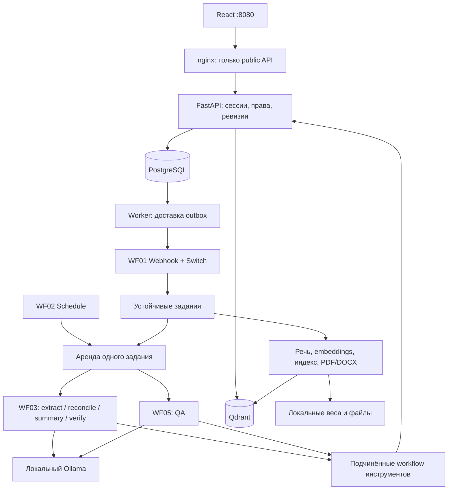

# Реализованная архитектура

Основа — приватный start-project.md. Этот файл фиксирует решения реализации, а не изменяет исходное ТЗ.

## Границы ответственности

n8n исполняет реальные агентов и триггеры. FastAPI проверяет доступ, ограничивает tools, назначает задачи, валидирует JSON и хранит состояния. Worker выполняет длительные операции. UI работает с backend и не требует доступа пользователя к редактору n8n.

Поток событий сохраняется в БД до отправки webhook. Повторный event ID не создаёт новый run. Claim сериализован PostgreSQL advisory lock и допускает одно тяжёлое задание на стенд. AI units используют аренду; worker продлевает её heartbeat. Commit проверяет token, revision и отмену; publication идемпотентна. Истёкшие аренды восстанавливает WF09, а не бесконечный цикл модели.

Транскрипт проходит целиком: последовательные chunks, manifest в jobs, сборка только после успешного завершения всех частей. Reconciler должен покрыть каждый candidate ID ровно один раз. Summary отдельно читает все реплики, включая части без поручений. Evidence Reviewer не является независимым доказательством истины — он использует ту же модель, окончательное подтверждение делает человек.

## Хранение

SQLAlchemy задаёт начальную идемпотентную схему v1: users, login_sessions, meetings, meeting_access, snapshots, jobs, events, reference_documents, notifications, tool_audit. Для будущего изменения структуры нужен отдельный миграционный шаг: `create_all` не изменяет существующие колонки.

Бизнес-данные находятся в PostgreSQL. У уже установленного n8n остаётся его собственное хранилище; оно не используется как база продукта. Секреты — `.env` и зашифрованные credentials n8n. UI получает HttpOnly SameSite session cookie. CRUD совещаний проверяет владельца/роль, optimistic revision и источник. Подтверждение создаёт snapshot, который используется для индекса и экспортов.

Реализованы API администратора `POST /api/users` и владельца `PUT /api/meetings/{id}/access` с reader/editor/none. Эти операции пока не вынесены в отдельную панель управления пользователями.

## RAG и инструменты

Embeddings формируются локально. Размерность определяется по реальному вектору; имя коллекции включает профиль и размер. Точки детерминированы по job/chunk/profile, повторный индекс не создаёт дубли. Индекс становится доступен только после завершения задания и проверки ревизии.

Поиск первой поставки ограничен **одним выбранным совещанием**. ACL и актуальная подтверждённая/indexed revision проверяются перед поиском и после него. Старые поколения не участвуют в выдаче. Вопрос получает первичный RAG-контекст в Context node, затем агент может вызвать scoped tools для дополнительных доказательств. Память между пользователями не используется.

Справочники добавляются явно и ограничены пользователем. Они не являются доказательством принятого решения. Эталонные ответы `docs/` не попадают в retrieval-конвейер.

## Принятые профили

- Qwen3 4B Instruct `qwen3:4b-instruct-2507-q4_K_M` вместо 8B из исходного варианта — для видеокарты 4 ГБ; контекст 4096, последовательные роли. Общий тег `qwen3:4b` использовать нельзя: он указывает на Thinking-вариант, что было проверено по шаблону и [каталогу Ollama](https://ollama.com/library/qwen3/tags). Это выбор оборудования, не гарантия качества казахского языка.
- Whisper small int8 CPU вместо large-v3 — начальный доступный профиль. Нужна отдельная оценка RU/KZ/mixed.
- WeSpeaker embeddings и агломеративная кластеризация вместо gated pyannote — локальная реализация без внешнего токена. Не заявлена точная обработка перекрывающейся речи.
- n8n подключён к существующей установке, её исходные workflow/volume сохранены. Поддерживающие сервисы изолированы в сети проекта; egress всего существующего n8n и Windows ещё требует отдельной политики заказчика.
- Первичный UI обслуживается FastAPI за nginx. Внешний шлюз не пропускает internal API.

## Восстановление и ограничения

Ошибки отображаются по jobs. Технический сбой ноды до явного fail может удерживать аренду до истечения; WF09 восстановит её. Повтор AI-задания ограничен тремя попытками. Длительные worker-ошибки сохраняются как failed для разбора, без бесконечного повторения проблемной записи.

Удаление закрывает доступ сразу; worker очищает источник, snapshot, экспорт и Qdrant. Резервные копии и старые логи исходного n8n имеют собственную политику хранения. Прототип не является промышленной системой управления секретами, бэкапами и пользователями.
