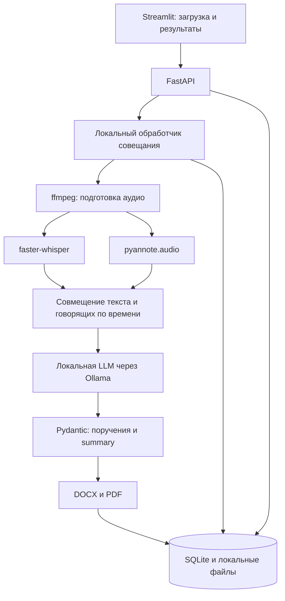

# План реализации HackAlem AI

## Обновление: этапы 8–9 — prompts и summary

Инструкция поручений вынесена в `app/prompts/action_items.txt` (UTF-8), правила
этапа 7 сохранены, запрет выдумывать факты/людей/сроки явно сформулирован.
Проверки перед следующим этапом: 34 теста prompt/извлечения/API прошли.

Реализован `MeetingSummaryService` через тот же `LocalLLMClient`, отдельный
`meeting_summary.txt`, строгая схема пяти разделов и API/SQLite хранения.
Проверяются ссылки, цитаты, цифровые записи и условность в схеме; выбранные
основные поручения копируются из этапа 7 без изменений. Версии источников сверяются.
Итог: 155 тестов, HTTP health — 200, compileall без ошибок. Ollama недоступна;
реальное качество summary не проверено. Семантические ошибки одной проверкой
цитат/чисел не исключаются. Подробности: [MEETING_SUMMARY.md](MEETING_SUMMARY.md).

## Обновление: этап 7 — извлечение поручений

Повторно сверены F-05/F-09, запрет внешних AI API и оба примерных протокола.
Добавлены `ActionItemExtractionService`, независимый `LocalLLMClient`, локальный
`OllamaClient`, строгая Pydantic/JSON Schema и API извлечения/чтения/статуса.
Поручения и снимки исходных сегментов сохраняются одной транзакцией SQLite.
Поддержаны null, условные решения, milestones, ссылки и точные цитаты.
Правила семантического анализа включены в prompt; код проверяет схему и grounding,
объединяет точные дубли, отклоняет конфликтующие. Обработки длинных записей по частям
пока нет: превышение контекста дает ошибку без обрезания.

Проверки: 128 автотестов, включая прежние слои и HTTP с явно тестовым локальным
сервером; smoke и compileall. 10 cases подготовлены для настоящей LLM; запуск
оценки остановился с `llm_not_configured`. Качество анализа не подтверждено.
Ollama на localhost недоступна. Stage 6/alignment не реализован: API анализирует
существующие сегменты STT, не приписывает им неподтвержденные имена говорящих.
Подробности и команды: [ACTION_EXTRACTION.md](ACTION_EXTRACTION.md).

## Обновление: этап 5 — диаризация

Добавлены `DiarizationService` / `PyannoteDiarizationService` для локальной
Community-1, API запуска/чтения/статуса и ручного сопоставления голосов с именами.
Результат — `data/processed/{meeting_id}/diarization.json`, перекрытия сохраняются.
Состояние и имена хранятся в новой таблице SQLite без изменения статусов STT.
Биометрическая идентификация не выполняется. Зависимости и подготовка весов
вынесены в `requirements-diarization.txt` и `scripts/prepare_diarization.py`.

Проверки: **79 тестов прошли**, включая прежние слои; HTTP health — 200.
Реальный импорт pyannote 4.0.7 и чтение WAV в torch прошли без сетевых соединений
Python, телеметрия выключена. Полный inference и качество диаризации не проверены:
Community-1 gated, доступ к весам еще не предоставлен. CUDA проверена только doubles.
Следующее: получить веса и проверить многоголосую запись; затем alignment, поручения,
summary и экспорт. Старые отчеты ниже отражают состояние на соответствующем этапе.

## Обновление: этап 4 — Speech-to-Text

Реализованы `TranscriptionService` и `FasterWhisperTranscriptionService`, схема
транскрипта, локальная подготовка весов, POST `/meetings/{id}/transcribe` и GET
`/meetings/{id}/transcript`. JSON атомарно сохраняется в
`data/processed/{meeting_id}/transcript_raw.json`. Старые записи SQLite сохранены.
Настройки `WHISPER_MODEL`, `WHISPER_DEVICE`, `WHISPER_COMPUTE_TYPE` и параметры
декодирования централизованы; task всегда transcribe, язык по умолчанию auto.
Статусы дополнены `transcribing` и `transcribed`; загрузка модели ленивая.

Проверки: **53 автотеста прошли**. Реальный прогон small/CPU включает русский,
казахский и склеенный RU/KZ; сквозной API сохранил и прочитал реальный JSON.
Качество казахского и смешанной речи пока недостаточно: см.
[STT_EVALUATION.md](STT_EVALUATION.md). CUDA проверена контрактными тестами,
не на GPU. Диаризация, поручения, summary и экспорт остаются следующими этапами.
Нумерация старой таблицы ниже историческая; текущее задание пользователя — этап 4.

## Обновление: загрузка и подготовка аудио

В текущем задании пользователь обозначил этот блок как **этап 3**; в исходной
таблице ниже подготовка аудио была этапом 2. Реализован именно слой загрузки,
а не STT. Добавлены POST `/meetings/{id}/upload`, локальное хранение пяти форматов,
реальный ffmpeg → WAV PCM 16-bit mono 16 kHz, таблица `meeting_audio`, статусы
`uploading`/`audio_ready`, ошибки, лимиты и защита от повторной загрузки.
Frontend и остальные стадии pipeline не реализованы.

Проверки: **30 тестов прошли**, включая реальную конвертацию wav/mp3/m4a/mp4/webm;
живой HTTP `/health` вернул 200. Есть предупреждение стороннего TestClient о
будущем переходе с httpx на httpx2; падений тестов нет.
Полный отчет: [REQUIREMENTS_REVIEW.md](REQUIREMENTS_REVIEW.md).

## Обновление: этап 1

Каркас реализован в `app/` (вместо первоначального `backend/app/`). Работают
четыре endpoint: GET /health, POST /meetings, GET /meetings/{id},
GET /meetings/{id}/status. POST создает только метаданные со статусом `created`;
обработка не запускается. SQLAlchemy сохраняет записи в локальной SQLite.
Созданы конфигурация ENV, логирование, README, зависимости и тесты.

По последнему указанию пользователя файл с примером ENV удален; `.env` и
все `.env.*` исключены из Git. Параметры документированы в README. Это изменение
заменяет первоначальное указание создать пример конфигурации.

Подготовлена локальная Python 3.11.16 `.venv`. Проверки: 15 тестов прошли;
проверяются API, перезапуск с сохранением базы, валидация и конфигурация.
AI-функции в таблице ниже по-прежнему не реализованы. Историческое описание
этапа 0 сохранено; актуальный статус каркаса указан в этом разделе.

## 1. Источник требований и состояние этапа 0

Главный источник: [ai-review/requirements.md](../ai-review/requirements.md), полностью изученный вместе с приложениями А–В. Файла `requirements.md` в корне на момент анализа нет. Используется существующий документ без создания второй копии. При противоречиях он имеет приоритет над запросом на разработку; стек и инженерные решения ниже не выдаются за требования организаторов.

Дата анализа: 23 сентября 2026 года. Ветка: `alish`.

В репозитории до этого этапа находятся только исходная документация и краткий README. Код приложения, зависимости и тесты отсутствуют. Этап 0 завершает анализ и планирование; функции продукта пока не реализованы. В доступном окружении `py --list` показывает Python 3.9; Python 3.11+ предстоит подготовить. `ffmpeg` и `ollama` не обнаружены в PATH, что не доказывает их отсутствие на диске. GPU, память и наличие моделей еще не проверены.

Правила посещения хакатона из раздела 8 источника остаются организационными обязанностями участников. Деловые поручения в приложениях являются тестовым материалом и не превращаются в задачи команды разработки.

## 2. Приоритеты и прослеживаемость

P0 — обязательный MVP и условия его безопасной демонстрации. P1 — только после подтвержденного основного сценария, если остается время. P2 — развитие продукта. Назначение приоритета не устраняет неоднозначности исходного ТЗ.

| Requirement | Приоритет | Компонент | Статус |
| --- | --- | --- | --- |
| Загрузка аудиозаписи и видеозаписи (§3.1) | P0 | API, файловое хранилище; UI позже | API реализован и проверен на пяти форматах |
| Подготовка аудио для моделей (инженерный шаг из запроса) | P0 | ffmpeg adapter | Реализовано: WAV PCM 16-bit mono 16 kHz |
| Speech-to-text, F-01 | P0 | faster-whisper adapter | Реализован; small на CPU реально проверена |
| Русский язык, F-02 | P0 | STT, анализ, демонстрационные данные | STT: один открытый пример, WER 7,7%; анализ позже |
| Казахский язык, F-03 | P0 | STT, анализ, демонстрационные данные | small: WER 46,7%; качество не закрыто |
| Смешанная RU/KZ речь, F-04 | P0 | STT, анализ, демонстрационные данные | Склейка: WER 46,3%, пропущен KZ; естественный code-switching не проверен |
| Диаризация, F-06 | P0 | pyannote adapter | Адаптер/API реализованы; полный inference ожидает gated-веса Community-1 |
| Привязка речи и поручений к конкретным участникам, F-06 | P0 | Alignment, сопоставление участников, анализ | Ручные имена готовы; извлечение использует текстовые ссылки; alignment отсутствует |
| Транскрипт и структурированный список поручений, F-09 | P0 | Схемы, API, UI, SQLite | Транскрипт JSON и API/SQLite поручений готовы; настоящее LLM-качество не проверено |
| Извлечение сути поручений, F-05 | P0 | Локальная LLM через Ollama | Сервис/адаптер/проверка схемы и цитат реализованы; Ollama пока недоступна |
| Ответственный: человек либо указанное подразделение, F-05, §9 | P0 | Анализ и валидация | Nullable responsible, проверка источника; качество извлечения ожидает модель |
| Срок поручения, F-05; сохранение неопределенности по §9 | P0 | Анализ и обработка дат | deadline_raw/null и milestones; нормализации относительных дат нет |
| Итоговое summary, F-08 | P0 | Локальная LLM, API/SQLite; UI позже | Сервис пяти разделов и цитат реализован; реальная LLM-оценка ожидает модель |
| Экспорт протокола, F-07 | P0 | python-docx, ReportLab | Планируем DOCX и PDF; оба еще не реализованы |
| Полностью локальная обработка аудио и текста, §4 | P0 | Все адаптеры, конфигурация, проверка сети | Запланировано; обязательное ограничение |
| Допустимость размещения в закрытом контуре, §4 | P0 | Локальные сервисы и предварительно загруженные модели | Запланировано |
| Приватность и анонимизация реальных демонстрационных записей, §3–4 | P0 | Хранение, логи, демонстрационные данные | Запланировано |
| Уведомление участников о записи и ИИ-транскрибации, §2 | P0 | Инструкция пользователю и экран загрузки | Запланировано; уведомление до записи остается обязанностью организатора встречи |
| Не коммитить секреты; документировать ENV в README (актуальное указание пользователя) | P0 | .gitignore, конфигурация | Реализовано на этапе 1 |
| README, установка, воспроизводимая проверка и ограничения, §5–7 | P0 | Документация, smoke-проверка | Текущий README недостаточен |
| Использование AI-агента, личный вклад, проект в рамках хакатона, §6–8 | P0 | Организация работы | AI-агент используется; остальные условия не проверены |
| Репозиторий команды и сдача на платформе, §6 | P0 | Процесс сдачи | Репозиторий есть; сдача продукта не выполнена |
| Напоминания о сроках/просрочке, §2 | P1 | Планировщик, уведомления | Отложено; обязательность в источнике неоднозначна |
| Дашборд «в работе / просрочено / выполнено», §3.4 | P1 | API и UI поручений | Отложено до готовности P0 |
| Классификация срочности/направления, §3.4 | P1 | Анализ | Отложено |
| Автоматическая рассылка выдержек, §3.4 | P1 | Адаптер доставки внутри разрешенного контура | Отложено; канал не выбран |
| Подключение к Teams/Zoom/Google Meet и live-поток, §3.1 | P2 | Адаптеры входа | Не начинать до рабочего pipeline; объем требований уточнить |
| Интеграция с СЭД, §3.4 и §4 | P2 | Интеграционный адаптер | Вне обязательной части |
| Голосовая идентификация по тембру, §3.4 | P2 | Идентификация участников | Вне P0; не заменяет обязательную диаризацию |
| Промышленное развертывание, §4 | P2 | Инфраструктура | Вне обязательной части |

## 3. Архитектура MVP

Выбран Streamlit: один простой экран загрузки и просмотра результатов позволяет сосредоточить разработку на pipeline. Backend — Python 3.11+, FastAPI, Pydantic, SQLAlchemy, SQLite. Это решение команды по текущему запросу, а не предписанный ТЗ стек.



Один экземпляр backend и последовательная обработка задач достаточны для первого прототипа. STT и диаризацию выполнять последовательно, если одновременная загрузка моделей превышает память. Очередь внутри процесса, статус выполнения и результаты сохранять локально; Redis, Celery и микросервисы для MVP не нужны. После перезапуска незавершенные задачи явно помечать прерванными, не изображая продолжение обработки.

### Границы модулей

- API принимает файл, возвращает ID встречи; отдельные операции возвращают статус, результат и экспорт. UI обращается к API, а не вызывает модели напрямую.
- ffmpeg извлекает аудиодорожку и подготавливает согласованный mono PCM WAV 16 кГц. Не вырезать паузы со сдвигом временной шкалы между STT и диаризацией.
- `SpeechToText` возвращает сегменты/слова с временными метками и текстом. Базовая модель — `large-v3`; модель, устройство и тип вычислений задаются ENV. Предусмотреть `medium`, `small`, `large-v3-turbo` или совместимый локальный набор весов. При обработке загружать только заранее скачанные файлы, без автоматического сетевого скачивания. Локальные модели и CPU INT8 поддерживаются выбранным движком; фактическую совместимость версий нужно проверить на этапе подготовки среды. [Документация faster-whisper](https://github.com/SYSTRAN/faster-whisper).
- `Diarizer` возвращает временные интервалы и метки говорящих. Планируется `pyannote/speaker-diarization-community-1` через `pyannote.audio`. Для предварительного получения весов нужны принятие условий модели и доступ Hugging Face; модель поддерживает загрузку из локального каталога для offline inference. Токен нужен только на этапе подготовки, не для передачи встреч. [Карточка community-1](https://huggingface.co/pyannote/speaker-diarization-community-1).
- Alignment совмещает слова/сегменты и интервалы по времени. Неопределенность и перекрывающаяся речь сохраняются явно. Метка `SPEAKER_00` сама по себе не доказывает имя: сопоставлять ее с именем только по подтвержденному контексту или вводу пользователя. Ответственный не обязан совпадать с говорящим.
- `MeetingAnalyzer` не зависит от конкретной LLM. Ollama вызывается по loopback, имя установленной локальной модели задается ENV. Передавать JSON Schema в structured output, затем валидировать ответ Pydantic. При невалидном результате — ограниченный повтор либо явная ошибка; не подставлять вымышленные задачи. [Structured outputs Ollama](https://docs.ollama.com/capabilities/structured-outputs).
- Экспорт использует один проверенный объект результата для DOCX и PDF; шрифт должен содержать русские и казахские символы.

### Предлагаемые контракты данных

Это инженерные решения, уточняемые при реализации:

- `Meeting`: ID, локальный путь записи, необязательная дата/часовой пояс встречи, статус, текущий этап, безопасное описание ошибки, режим `real` или `mock`.
- `TranscriptSegment`: ID, начало/конец, исходный текст, метка говорящего, подтвержденное имя или `null`.
- `ActionItem`: суть, ответственный человек/подразделение либо `null`, исходная формулировка срока, нормализованная дата либо `null`, ссылки на подтверждающие сегменты, отметка неопределенности.
- `MeetingResult`: транскрипт, поручения, summary, предупреждения о неполноте и режим обработки.

Не подставлять текущий год или день в сроки из примеров. При отсутствии даты встречи сохранять «до пятницы» как исходный текст; неуказанный срок остается неизвестным. Различать автора поручения, исполнителя и подразделение; сохранять условность решений. Не считать валидный JSON доказательством фактической правильности.

## 4. Локальность и конфигурация

Разделить подготовку и обработку. Загрузку пакетов/весов выполнять заранее без данных совещаний. Обработку демонстрировать с запрещенным внешним исходящим трафиком и разрешенным loopback. Убрать телеметрию и автоматические загрузки используемых компонентов; отсутствие моделей должно давать понятную ошибку, а не облачный fallback.

Не добавлять облачные OpenAI, Google Speech, Azure Speech, Whisper, pyannote, Claude, Gemini или иные AI API. Ollama на localhost должен использовать локальную модель, а не проксировать запрос облачному провайдеру. Произвольный удаленный URL в ENV не должен незаметно обходить ограничение. Расширение на self-hosted узел закрытого контура потребует явной настройки и отдельной проверки.

На этапе 1 создать документацию ENV в README без секретов и `.gitignore` для `.env`, токенов, локальных записей, базы, экспортов, моделей и кэшей. Планируемые настройки: пути данных и моделей, STT model/device/compute type, путь модели диаризации, Ollama URL/model, путь шрифта PDF и режим адаптеров. Входные данные и содержимое LLM-промптов не выводить в обычные логи. Реальные материалы демонстрировать только после анонимизации; синтетические записи разрешены.

## 5. Планируемая структура каталогов

Ниже целевая структура, а не перечень уже созданных файлов.

```text
ai-review/requirements.md       # единый главный источник требований
docs/IMPLEMENTATION_PLAN.md     # этот план и статусы
app/
  main.py                      # FastAPI
  config.py                    # ENV и проверка локального режима
  schemas.py                   # Pydantic-контракты
  db.py                        # SQLAlchemy/SQLite
  api/meetings.py               # загрузка, статус, результат, экспорт
  pipeline/runner.py            # порядок этапов, ошибки и состояние
  pipeline/alignment.py         # совмещение STT и диаризации
  adapters/                    # интерфейсы и реальные реализации
    audio.py
    stt.py
    diarization.py
    analysis.py
  export/                      # DOCX/PDF
frontend/app.py                 # Streamlit
tests/
  unit/
  integration/
  fixtures/                    # только синтетические/разрешенные данные
scripts/                       # подготовка моделей и диагностика
data/                          # записи, SQLite, результаты; вне Git
models/                        # скачанные веса; вне Git
.gitignore
pyproject.toml                 # Python и зависимости
README.md
```

## 6. Последовательность этапов и проверки

Перед каждым крупным этапом перечитать относящиеся к нему разделы главного источника и сверить изменения с таблицей требований. После этапа: сообщить результат и перечень файлов, выполнить доступные проверки, исправить ошибки, проверить прежние сценарии и обновить статусы. Не объявлять непроверенные функции работающими.

| Этап | Результат и основные файлы | Проверки и условие завершения |
| --- | --- | --- |
| 0. Анализ | `docs/IMPLEMENTATION_PLAN.md` | Полное чтение источника, покрытие F-01–F-09, разделение P0/P1/P2, проверка ссылок и diff |
| 1. Каркас и среда | `pyproject.toml`, `.gitignore`, README, `app/main.py`, `app/core/`, `app/schemas/`, `app/db/` | Выполнено: Python 3.11, API, SQLite, ENV, 15 тестов; живой HTTP-запрос /health вернул 200 |
| 2. Вход и подготовка аудио | API загрузки, `audio.py`, runner, минимальный Streamlit | Синтетические аудио и видео проходят ffmpeg; поврежденный файл/отсутствующая дорожка дают ошибку; безопасные имена, ограничения ресурсов; каркас продолжает запускаться |
| 3. STT | `stt.py`, подготовка весов, проверки RU/KZ/RU-KZ | Реальное локальное распознавание трех типов речи; временные метки; пустая запись; замер ресурсов и проверка переключения модели |
| 4. Диаризация и alignment | `diarization.py`, `alignment.py`, отображение говорящих | Реальный клип с несколькими говорящими; короткие/перекрывающиеся реплики; STT не сломан; подтвержденная привязка имени либо явная неопределенность |
| 5. Поручения и summary | `analysis.py`, схемы результатов, UI результата | Локальная LLM и JSON Schema; отсутствующие сроки, разные исполнители, пересмотр сроков и повторы; обработка таймаутов/невалидного JSON; тестовые протоколы без утечки эталонных саммари во вход |
| 6. Экспорт | `export/`, API скачивания и кнопки UI | Реальные DOCX/PDF открываются; кириллица и Ә Ғ Қ Ң Ө Ұ Ү Һ І отображаются; длинные таблицы и переносы читаемы; результат совпадает с UI |
| 7. Сквозная демонстрация | README, integration tests, разрешенные fixtures, актуальные статусы плана | Реальная запись → оба экспорта без внешнего трафика; RU/KZ/RU-KZ; ошибки зависимостей; повторный запуск по README; известные ограничения перечислены |
| 8. Дополнительные функции | Только выбранные P1 | Начинать после подтверждения этапа 7; повторить основной сценарий после изменений |

При недоступной зависимости остальные модули разрабатывать через интерфейсы и явно обозначенные mock-адаптеры с синтетическими fixtures. Mock включается только явной настройкой, маркируется в API/UI/экспорте и не заменяет реальный запуск при приемке P0. Режим `real` не должен автоматически переключаться на mock или «одного говорящего». Статус зависимого требования остается «не проверено/ожидает зависимость», даже если контрактные тесты проходят.

## 7. Проверка качества на исходных примерах

Приложения Б и В использовать как материал для тестов извлечения, отделяя реплики от готового саммари. Текстовые проверки не подтверждают STT и диаризацию.

- Пример 1: десять поручений в исходной таблице; юридический департамент как ответственный; аудит к 15 октября после изменения срока; условное расторжение договора; повторное перечисление не создает дубликатов.
- Пример 2: Ерлан исполняет претензию, Ботагоз ищет поставщика; справка нужна после совещания; неделя на смету и месяц на закрытие очереди; срок Салтанат не указан. Допустимо разделение составного поручения на несколько связанных задач: количество строк само по себе не является метрикой полноты.
- Проверять ссылки на исходные реплики, корректность ответственного и срока, пропуски и вымышленные поручения, сохранение фактов в summary.
- Для аудио подготовить короткие разрешенные записи на русском, казахском и смешанном языке с несколькими говорящими и ручной разметкой. Фиксировать ошибки распознавания, ошибки говорящих и время обработки. Порогов качества в ТЗ нет: не придумывать нормативные числа и не обещать качество без измерений.

## 8. Риски и решения

| Риск | Практическое действие |
| --- | --- |
| Python 3.9 в текущей среде вместо 3.11+ | Подготовить отдельную совместимую среду, проверить зависимости до скачивания больших моделей |
| Неизвестны GPU/RAM/VRAM; large-v3 может работать медленно | Проверить ресурсы; выбирать модель и тип вычислений через ENV; замерить на коротком клипе, не обещать real-time |
| Совместимость PyTorch, CTranslate2, CUDA и аудиобиблиотек | Зафиксировать проверенные версии; сначала smoke-проверки отдельных адаптеров |
| Доступ к весам pyannote и условия модели | Проверить доступ на этапе подготовки; сохранить полный локальный набор; при блокировке продолжать контрактные тесты, не заявлять готовую диаризацию |
| Неизвестное качество казахского и переключения языков | Отдельные реальные тесты KZ/RU-KZ; не принуждать всю смешанную запись к русскому языку |
| Диаризация не устанавливает имя автоматически | Использовать подтвержденный контекст/сопоставление пользователем; сохранять неизвестное имя явно |
| Ошибки и выдумки LLM, инструкции внутри транскрипта | Считать транскрипт данными, применять схемы и проверку ссылок на реплики; не давать модели инструментов выполнения действий |
| Длинная встреча превышает контекст LLM | Делить по репликам с контролируемым перекрытием, объединять и убирать дубликаты; проверить, что поздние исправления не теряются |
| Скрытая загрузка, телеметрия или облачная модель за localhost | Подготовка отдельно от inference; отключение сетевых функций и проверка при заблокированном внешнем трафике |
| Нет даты встречи, сроки неоднозначны | Сохранять исходную формулировку и `null` для неподтвержденной даты |
| PDF не содержит казахские глифы | Локальный шрифт с нужным покрытием, визуальная проверка обоих экспортов |
| Только пять часов по инструкции хакатона | Последовательные небольшие этапы; весь P1/P2 отложен; ограничения честно отражать в README |

## 9. Неоднозначности, сохраненные из источника

- PDF/DOCX: источник не уточняет, нужен один или оба формата. В плане выбраны оба по текущему запросу, без приписывания этого толкования организаторам.
- Teams/Zoom/Google Meet перечислены во входах, но объем обязательных интеграций не определен. По текущему запросу сначала реализуется файловый pipeline; полноценное соответствие интеграционной части не заявлять.
- Напоминания присутствуют в сценарии, но не в списке минимума. Они отложены до P1, а не объявлены отсутствующим требованием.
- Закрытый контур встречается среди дополнительных функций, но запрет внешних API прямо установлен ограничениями: локальность остается P0.
- Точные даты примеров, дедлайн мероприятия, ресурсы и количественные пороги качества не заданы.

## 10. Итог этапа 0

Создан только этот план. Главный источник и README не изменялись; приложение еще не реализовано. Проверки этапа: чтение всех разделов и приложений, покрытие обязательных функций, существование ссылки на источник, корректность структуры таблицы и отсутствие ошибок whitespace. Исполняемых тестов приложения пока нет. Следующий этап — каркас, конфигурация и подготовка среды с повторной сверкой разделов 3–4 источника.
